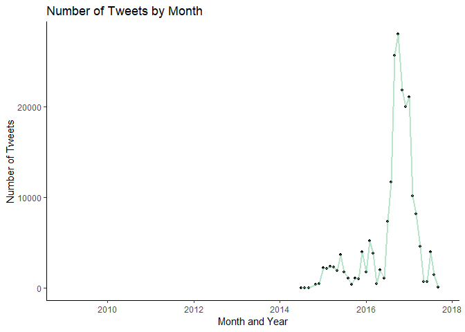

# Abstract
*This analysis researches a selection of Tweets obtained in by NBC in the wake of the 2016 election interference campaign by Russian assets. Using social network analysis, topic modeling, and other machine learning techniques I’m aiming to understand the messages and factors which differentiated effective trolls from non-effective trolls. The implication for this work was determining what and how trolls were able to build influence, serving as a blueprint from which to formulate countermeasures.*

# Introduction
In the lead up to the 2016 presidential election Russia’s “Internet Research Agency” (IRA) worked to gain influence on various social media platforms. Since as early as 2009 Russia has used social media to influence domestic politics. The U.S. election of 2016 represents the dramatic realization that these efforts were also occurring abroad. While their role and impact has been debated by those who had the most to gain by the troll activities, the US intelligence agencies stand united in their indictment of the IRA. The trolls aim was to polarize the US electorate and sow disinformation, capitalizing on various conspiracy theories and extremist rhetoric.
This analysis seeks to understand and quantify the efforts of the Russian influence campaign during the 2016 election. In doing so, I’m aiming to provide a blueprint of what makes a troll effective through analysis of their social network graph and messaging. Using machine learning models the analysis attempts to understand and predict features which may indicate troll success. This in effort to lay the groundwork for developing methods to identify and counteract troll behavior.


## EDA

Exploring the data we see that troll users were created as far back as 2014.

<!-- -->

A general graph of tweets over time shows a crescendo of tweets leading upto the November 2016 election.

<!-- --><!-- -->

Overlaying of other significant events during the 2016 election and the number of tweets sent by trolls. While this analysis will focus specifically on election day, additional analysis should be able to reflect the messaging related major news stories or events which (presumably) triggered the spike in activity. 

<!-- -->

To identify users from retweeted text, a short function parses mentioned users into an edgelist of the sending and receiving user. This list is compared to the dataset of known trolls to differentiate troll and non-troll users. Degree centrality, Betweeness, and Eigen centrality metrics are then calculated from the resulting edgelist. (Closeness centrality was omitted given the highly disconnected nature of the resulting network).


## Network Graph

Using a Fruchterman Reingold layout, the edge list is graphed. Node size is related to degree centrality, a simple popularity metric counting the number of "edges" running through the node. Node label are sized according to betweeness centrality, a measure of information brokerage, and idenfy the users who control the flow of information across nodes (Only three such users are identified here). Node and label color reflects troll (red) or non-troll (green) users. Here we can see the general structure, with trolls disemminating information out to groups of unlinked non-troll users. This supports what we have come to know about the election interference campaign, that trolls created messages targeted at specific subsets of users. 

<!-- -->


## Text Analysis

Text analysis was performed using a small function to preprocess tweet text including: stemming, stop words removed, puncuation removed, conversion to lower case, numbers removed, white space removed. Additional words removed include "rt","amp","http". 


Natural language processing using Latent Dirichlet allocation, using k=2 for simplicity, the top 10 terms for each topic are plotted. 


<!-- -->

While word clouds have limited utility in text analysis, this is a plot of the top terms sized according to frequency from trolls on election day. 

<!-- -->

## Community Detection

Using cluster edge betweenness, high betweeness edges are removed sequentially untill the best partitioning of the network is achived. Each community had average betweeness centrality calculated to find the "community of information brokers" in the network. In this example, troll community 9 had the highest average betweeness centrality (2).


```
##    membership       bet
## 9           9 2.0000000
## 11         11 0.2352941
## 1           1 0.0000000
## 2           2 0.0000000
## 3           3 0.0000000
```


Plot of the high betweenness community compared to the wider network graph, community 9 with highest average betweeness is show in red. Other detected communities containing more than 4 trolls shown in shades of green.

<!-- -->


## LDA Tuning

This community was then subset and their tweets were preprocessed as outlined above. On larger data sets LDA tuning has significant performance impacts. On this smaller subset of community 9, LDA tuning was performed to find an optimal K values (between K=2 and k=15) for further topic analysis.
The minimize function suggests a k=2, with the maximize function showing k=5. We'll setting on a K=3 for the remaining analysis.

<!-- -->


Information brokers community topic plot

<!-- -->


As we continue to dive into the topic modeling aspect, I'm looking to map topics across the different communities and observe how different messages are sent to different groups of non-trolls. We'll also look at determining features of more effective trolls. 
